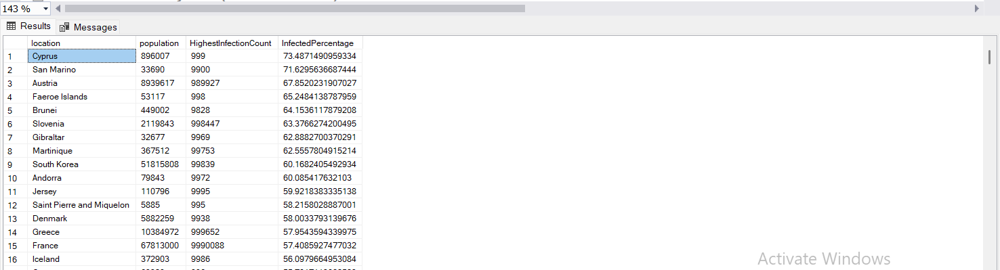
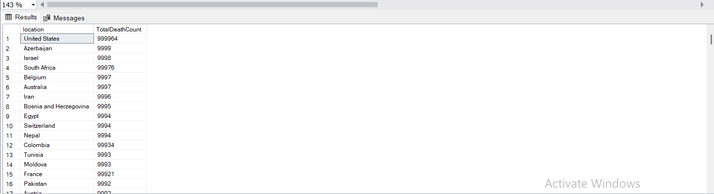

# **Global COVID-19 Data Exploration & Insight Extraction Using SQL**

## **Project Overview**
COVID-19 reshaped public health, mobility, and economic activity worldwide. While dashboards provided fast reporting, fewer efforts focused on structured analytical exploration of pandemic data to understand geographic patterns, mortality ratios, and continent-level disparities.  
This project uses SQL to interrogate global COVID-19 data and extract quantitative insights around cases, deaths, and population-adjusted risk.

## **Purpose**
**Primary Goal:** Perform structured SQL-based exploratory analysis to quantify the scale, distribution, and severity of COVID-19 across countries and continents.

**Secondary Goal:** Translate raw epidemiological data into interpretable metrics such as mortality percentage, population-normalized case counts, and cross-region comparisons.

## **Technical Stack**
- **Microsoft SQL Server Management Studio (SSMS)**
- **SQL (CTEs, Joins, Aggregations, Window Functions)**
- **CSV Data Files (Our World in Data)**

## **Data Source**
Data sourced from **Our World in Data**, covering:
- Global daily cases and deaths
- Country and continent identifiers
- Population counts
- Reporting dates

**Coverage Period:** *1 January 2020 → 3 May 2023*

## **Analytical Narrative & Key Questions**

### **Analytical Questions**
The study was structured around epidemiological and socio-geographic questions such as:
1. What is the global scale of confirmed COVID-19 cases and deaths?
2. Which countries experienced the highest mortality burden?
3. How do cases compare after adjusting for population exposure?
4. Which continents saw the heaviest concentration of cases and deaths?
5. How severe was the pandemic when expressed as global death percentage?

These questions move from **total magnitude → proportional severity → comparative burden**.

## **SQL Approach & Methodology**

### **Data Exploration Techniques**
- **Aggregations:** Total cases & deaths at global and regional levels
- **Population Normalization:** Cases per population to identify true exposure severity
- **Grouping:** Country and continent-level comparisons
- **Window Functions:** Ranking countries by mortality and infection rates
- **Filtering:** Handling NULL reporting periods and incomplete regional data

SQL served as a powerful tool for **direct computation**, avoiding premature visualization bias and keeping analysis grounded in epidemiological metrics.

## **7. Insight Highlights (Quantitative Findings)**

### **Global Scale of COVID-19**
- **Total Confirmed Cases:** 765,237,628
- **Total Deaths:** 6,928,131
- **Global Death Percentage:** ~0.91%

### **Country-Level Burden (Population Normalized)**
When adjusted for population exposure:
- **Top Impacted Countries:** Cyprus, San Marino, Austria

This metric reframes severity beyond absolute counts, highlighting countries with smaller populations but high exposure rates.

### **Mortality Leaders (Absolute Death Counts)**
- **Top Countries by Deaths:** United States, Brazil, Israel

These countries also represent large population centers, showing the distinction between **exposure vs. mortality**.

## **Interpretation**

The exploration surfaced several analytical themes:
- **Magnitude ≠ Severity:** High case counts did not universally imply high mortality rates.
- **Population Adjustment Matters:** Small countries can rank among the most affected when normalized.
- **Regional Exposure:** Continents exhibited distinct epidemiological behaviors tied to mobility, density, and public health strategies.
- **Temporal Depth:** The multi-year span allowed post-peak understanding rather than early snapshot bias.

This demonstrates why pure totals underrepresent pandemic dynamics without contextual metrics.

## **Key Takeaways**
- SQL enables structured exploration of epidemiological data without visualization overhead.
- Population normalization changes the ranking landscape dramatically.
- Mortality and exposure metrics must be interpreted together to avoid misleading conclusions.
- Geographic rollups reveal continent-level disparities masked at national scale.
- Raw data → Insight requires careful metric selection, not just reporting.

## **11. Summary**
This project exemplifies the value of SQL as an analytical tool for real-world dataset interrogation. By computing totals, ratios, rankings, and population-adjusted metrics, the analysis transforms global COVID-19 data into epidemiological insight — reinforcing the role of structured data exploration in understanding complex public health events.

